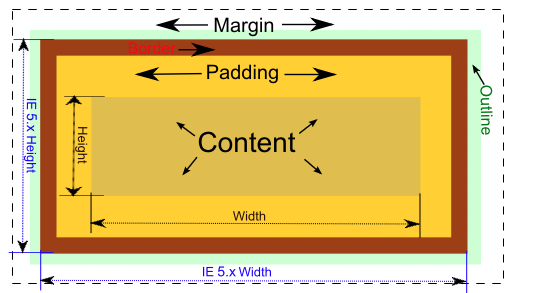

# A Comprehensive Guide to CSS

## 0. Required Resources
- **[YouTube Video 20 MInutes Intro to CSS](https://www.youtube.com/watch?v=1PnVor36_40)
- **[YoutTube Video 10 Minutes on How to Use the DevTools Inspector](https://www.youtube.com/watch?v=151NXMk0a2c)

### Helpful Resources - If you really want to Learn This Like a Pro
- [Very Helpful Reading - Mozilla FireFox Developer School](https://developer.mozilla.org/en-US/docs/Learn/CSS/First_steps)
- [W3Schools CSS Main Resource with Examples - Good for a Quick Reference](https://www.w3schools.com/w3css/defaulT.asp)

## 1. Introduction to CSS and HTML

The World Wide Web has come a long way since its inception by Tim Berners-Lee in 1989. Initially, the Web offered no way to style a website, but over time HTML (HyperText Markup Language) and CSS (Cascading Style Sheets) emerged as the cornerstone for web design and layout.

HTML, which provides the structure of a page, was created in 1990, but it was not until 1996 that CSS, a style sheet language, came into existence. CSS was designed to separate the website's content (HTML) from its design and layout (CSS), promoting web standards and accessibility.

But why did it take six years for a styling language to come along? The answer lies in the early web's primary use. Berners-Lee, and his employers at CERN, were initially focused on using the Web as a way to share and manage documents among scientists. Layout and design weren't a priority.

In the interim, different approaches to web page layout emerged, and browsers implemented these concepts inconsistently. For instance, Netscape Navigator introduced its own HTML tags for design purposes, leading to web pages losing their semantic value.

In 1994, Håkon Wium Lie proposed CSS as a way to style web pages. Its simplicity and its ability to allow styles to cascade—i.e., styles could inherit and overwrite other styles following a defined hierarchy—appealed to the web community. Moreover, CSS allowed for multiple stylesheets on the same page.

Since then, CSS has evolved and has become an integral part of web design, with almost all web pages using the language to describe their look and formatting. The adoption of CSS has brought about a standard in web design, allowing developers to create aesthetically pleasing and consistent designs across different web pages and sites.

The following sections will dive deeper into HTML and CSS, their syntax, best practices, and key concepts like the CSS Box Model, a fundamental concept that controls layout in CSS. We'll also discuss how to effectively use the power of CSS classes and IDs, how to implement responsiveness in your design, and more. With a solid understanding of HTML and CSS, you'll be well-equipped to create appealing, accessible, and standard-compliant websites.
---
# HTML and CSS Vocabulary and Key Concepts

This guide will help you understand key terms and concepts in HTML and CSS, improving your proficiency in building web applications.

## 1. HTML and CSS Basics

- **HTML (HyperText Markup Language):** The standard language for creating web pages and web applications. HTML provides the structure of a web page.

- **CSS (Cascading Style Sheets):** A stylesheet language used for describing the look and formatting of a document written in HTML. CSS is primarily used for the layout and design of a web page.

- **Element:** In HTML, an element is a piece of content in an HTML document and uses a start tag and an end tag.

- **Tag:** HTML tags are used to create HTML elements. They typically come in pairs, a start tag and an end tag.

- **Attribute:** Attributes provide additional information about an HTML element and always come in name/value pairs.

## 2. CSS Selectors and Properties

- **Selector:** In CSS, selectors are used to select the HTML element(s) you want to style.

- **Property:** A property in CSS defines what aspect of the selector will be styled.

- **Value:** The value in CSS is the setting you want to apply to a property.

- **Declaration:** A CSS declaration is a property-value pair that applies a certain style.

- **Rule-set:** A CSS rule-set consists of a selector and a declaration block.

## 3. CSS Box Model and Responsive Design

- **Box Model:** The CSS box model is a fundamental concept in CSS and is used when talking about design and layout. It consists of margin, border, padding, and the actual content.

- **Responsive Design:** A design strategy aimed at making web pages render well on different devices and window or screen sizes.

> Remember, HTML is responsible for the structure of the page, and CSS is responsible for the design and layout.

# CSS Selectors and Selector Strategy

CSS selectors are the means by which CSS targets HTML elements to style. Understanding how to utilize CSS selectors effectively can dramatically streamline your code and ensure you're styling elements efficiently.

## 1. Basic CSS Selectors

- **Element Selector:** Targets HTML elements using their name (e.g., `body`, `h1`).
- **Class Selector:** Targets HTML elements using their class attribute (e.g., `.classname`).
- **ID Selector:** Targets a specific HTML element using its id attribute (e.g., `#idname`).

## 2. Combinator Selectors

- **Descendant Selector:** Targets an element within another element (e.g., `div p`).
- **Child Selector:** Targets direct children of an element (e.g., `div > p`).
- **Adjacent Sibling Selector:** Targets an element immediately following another element (e.g., `div + p`).
- **General Sibling Selector:** Targets elements following another element (e.g., `div ~ p`).

## 3. Pseudo-class and Pseudo-element Selectors

- **Pseudo-classes** let you style an element when it's in a certain state (like when a user hovers over it).
- **Pseudo-elements** let you style a specific part of an element (like the content before an element's content).

## 4. Selector Strategy

- **Be Specific but Not Too Specific:** Balance is key. Overly broad selectors can lead to unwanted style changes, while overly specific ones can make your CSS hard to manage. Aim for a level of specificity that styles elements as intended without unnecessarily complicating your code.
- **Reuse Styles:** Keep your code DRY ("Don't Repeat Yourself"). If multiple elements share a style, consider a class selector.
- **Lean on Inheritance:** Many CSS properties naturally inherit styles from parent elements. Utilize this to write less code.

# Layout, Spacing and the CSS Box Model

The CSS box model is a fundamental concept that describes the design and layout of elements in CSS. It's essentially a box that wraps around every HTML element, and it consists of margins, borders, padding, and the actual content. 

## 1. Box Model Components

- **`Content`:** The actual content of the HTML element, like text, images, or other media.
- **`Padding`:** The space around the content, within the element.
- **`Border`:** This sits outside the padding and encloses an element.
- **`Margin`:** The outermost layer, creating space around the element and other elements.

> The total width and height of an element is the sum of its content, padding, border, and margin.

# CSS Measurements

CSS measurements can be either absolute or relative.

## 1. Absolute Units 

- **Pixels (px):** Fixed units of measurement, commonly used for fixed-size elements.

## 2. Relative Units 

- **Percentages (%):** Relative to the parent element's size.
- **Viewport units (vw, vh):** Relative to the size of the browser window.
- **em and rem:** Relative to font sizes, `em` to the nearest parent font size, `rem` to the root font size.

# Responsive Design and Media Queries

Responsive design ensures your website looks good and works well on all devices - from mobile phones and tablets to laptops and large desktop monitors.

- **Media Queries:** Apply different styles for different media types and conditions.

# CSS Best Practices

- **Use Classes for Multiple Elements:** If you have multiple elements that share the same styles, use a class to style those elements.
- **Keep It DRY:** Avoid repeating the same code. Find ways to reuse code and keep your stylesheets concise.
- **Leverage CSS Inheritance:** CSS inheritance allows properties set on parent elements to be inherited by their child elements.
- **Use Comments:** Using comments in your code can help you and others understand it later.

# Learning More

CSS is a vast language with many more properties and concepts to explore. Good resources for further learning include Mozilla Developer Network (MDN), W3Schools, and CSS-Tricks. CSS is a critical tool in web design, allowing you to define the look and feel of a website. Happy coding!
